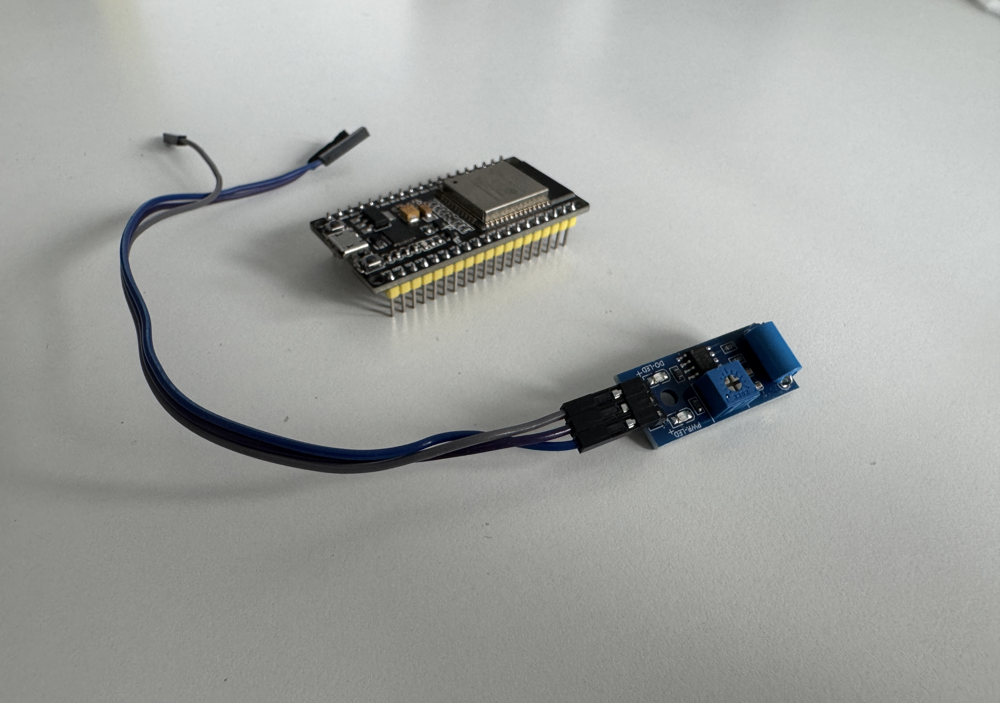

# ESP32 Vibration Sensor With OLED

This project is a small PlatformIO example for a generic ESP32 development board connected to a digital vibration sensor and a 128x64 OLED display. It detects vibration events, prints the current status to the serial monitor, and mirrors the same state on the display.

The repository is intended as a simple starting point for hardware testing, demos, or building a more advanced vibration alarm or monitoring project.



## Features

- Reads a digital vibration signal on an ESP32 GPIO pin
- Prints live status updates over Serial at `115200` baud
- Shows the current state on a 128x64 OLED using `U8g2`
- Uses the Arduino framework with PlatformIO
- Keeps the example intentionally small and easy to adapt

## Hardware Requirements

- 1 x Generic ESP32 development board
- 1 x SW-420 vibration sensor module
- 1 x 128x64 OLED display compatible with `U8g2`
- Jumper wires
- USB cable for power, upload, and serial monitoring

## Hardware Used In This Project

- ESP32 board: `esp32dev` PlatformIO target
- Vibration sensor: `SW-420`
- OLED display type inferred from code: `SH1106 128x64 I2C`

## Wiring Overview

The firmware confirms this connection:

| Function | ESP32 Pin | External Module Pin | Notes |
| --- | --- | --- | --- |
| Vibration input | `GPIO4` | Sensor digital output | Defined in `src/main.cpp` as `VIBRATION_PIN` |
| OLED SDA | board-dependent | OLED SDA | The code uses hardware I2C defaults |
| OLED SCL | board-dependent | OLED SCL | The code uses hardware I2C defaults |
| Power | board-dependent | Sensor VCC / OLED VCC | Verify module voltage requirements |
| Ground | GND | Sensor GND / OLED GND | Common ground is required |

Typical ESP32 defaults often used for I2C are:

- SDA: `GPIO21`
- SCL: `GPIO22`

OLED I2C displays commonly use address `0x3C`, but users can adapt the address and wiring to match their own module.

For additional hardware notes, see [docs/hardware.md](docs/hardware.md).

## Project Structure

- `src/main.cpp`: main firmware
- `platformio.ini`: PlatformIO environment and library dependency configuration
- `docs/hardware.md`: wiring and integration notes
- `assets/vibration.jpg`: project image used in this README

## Software Dependencies

This project builds with PlatformIO and currently declares:

- `U8g2`: graphics library used to drive the SH1106 OLED display

The code also includes:

- `Arduino.h`: core Arduino framework APIs
- `Wire.h`: I2C support used by the OLED driver

## PlatformIO Environment

The configured environment is:

- `env:esp32dev`
- Platform: `espressif32`
- Framework: `arduino`
- Monitor speed: `115200`

## Build And Upload

Install [PlatformIO](https://platformio.org/) and open this project folder.

Build the firmware:

```bash
pio run
```

Upload to the board:

```bash
pio run --target upload
```

Open the serial monitor:

```bash
pio device monitor
```

## Serial, I2C, And Display Notes

- Serial output runs at `115200` baud.
- The OLED is driven over I2C through the ESP32 hardware I2C interface.
- The sketch does not explicitly assign custom I2C pins, so final SDA/SCL mapping depends on your board defaults or platform configuration.
- No Wi-Fi, SPI, or UART peripherals other than the USB serial console are used by the current firmware.

## Configuration And Secrets

The current project does not require Wi-Fi credentials, API keys, tokens, or other runtime secrets.

The repository is still prepared so that a future private configuration file such as `include/config.h` can stay untracked if you later extend the firmware with Wi-Fi or cloud features.

## Verifying Operation

1. Connect the vibration sensor and OLED display.
2. Upload the firmware to the ESP32.
3. Open the serial monitor at `115200` baud.
4. Tap or shake the sensor module.
5. Confirm that the serial output changes between quiet and vibration detected states.
6. Confirm that the OLED updates with the same status.

## Notes And Limitations

- The code reads a digital vibration signal only. It does not currently measure vibration intensity.
- The example is documented around an `SW-420` vibration sensor module.
- Final OLED wiring and power compatibility depend on the specific board and display module you use.
- If your OLED does not respond, verify controller compatibility, I2C wiring, voltage, and address.

## License

This repository is released under the [MIT License](LICENSE).
